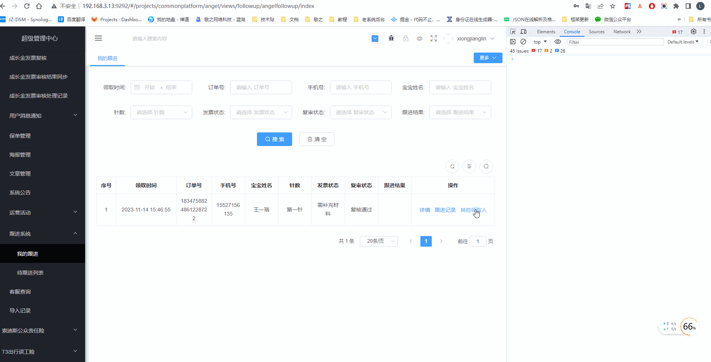
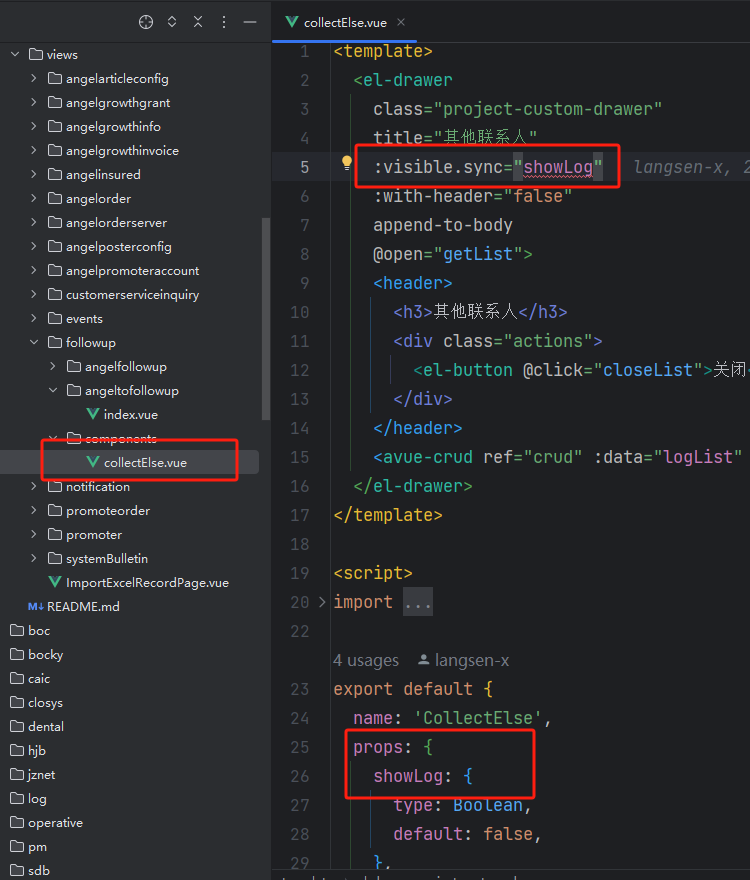
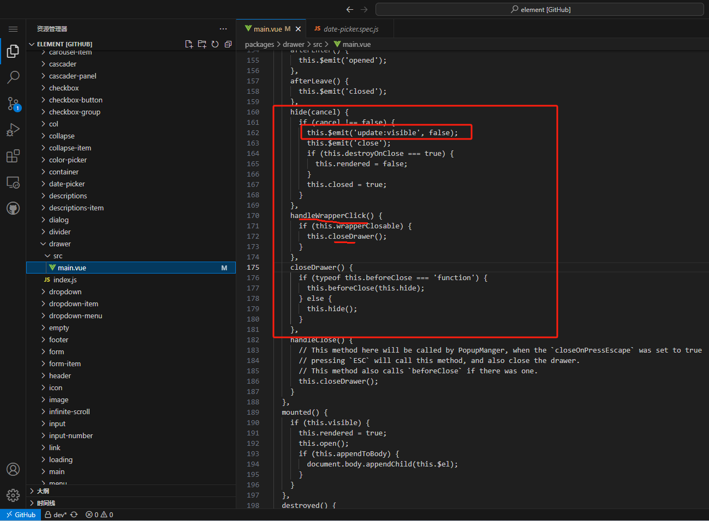

# Reflections-on-bugs
工作中出现的bug记录及反思
 
### I(i) & l(L) 混淆
- 源头问题：没有复制粘贴后端给到的参数，导致参数手写出错（我的问题）
- 问题延伸：必传参数未传，后端接口应该报错啊（后端需优化）
- 测试为什么没有测出来？   我也不知啊
> **注意： 该CV的得CV啊，习惯养成！！！**

### 文案出错
> 注意同上

### 需求未考虑历史数据问题
- 在需求评审阶段就应该考虑到后续迭代的需求变更对历史数据的影响

### props组件传参字段不要用于.sync修饰符上（参数值不允许被修改）


- 在没有添加:wrapperClosable=”false”时会报错，当点击遮罩层关闭弹窗时会直接修改props值，因为props用了.sync修饰符，element-ui源码中直接emit了

解决方案一: computed </br>
子组件:
```html
<template>
  <el-drawer
    class="project-custom-drawer"
    title="其他联系人"
    :visible.sync="show"
    :with-header="false"
    append-to-body
    @open="getList">
    <header>
      <h3>其他联系人</h3>
      <div class="actions">
        <el-button @click="closeList">关闭</el-button>
      </div>
    </header>
    <avue-crud ref="crud" :data="logList" :table-loading="logListLoading" :option="logListOption"></avue-crud>
  </el-drawer>
</template>

```
```js
export default {
  name: 'CollectElse',
  props: {
    showLog: {
      type: Boolean,
      default: false,
    },
    growthId: {
      type: String,
      default: '',
    },
  },
  data() {
    return {
      logListOption,
      logListLoading: false,
      logList: [],
    }
  },
  computed: {
    show: {
      get() {
        return this.showLog
      },
      set(val) {
        this.$emit('update:showLog', val)
      }
    }
  },
  methods: {
    getList() {},
    closeList() {
      this.$emit('update:showLog', false)
    },
  },
}
```

解决方案二: watch </br>
子组件:
```html
<template>
  <el-drawer
    class="project-custom-drawer"
    title="其他联系人"
    :visible.sync="show"
    :with-header="false"
    append-to-body
    @open="getList">
    <header>
      <h3>其他联系人</h3>
      <div class="actions">
        <el-button @click="closeList">关闭</el-button>
      </div>
    </header>
    <avue-crud ref="crud" :data="logList" :table-loading="logListLoading" :option="logListOption"></avue-crud>
  </el-drawer>
</template>
```
```js
export default {
  name: 'CollectElse',
  props: {
    showLog: {
      type: Boolean,
      default: false,
    },
    growthId: {
      type: String,
      default: '',
    },
  },
  data() {
    return {
      show: this.showLog,
      logListOption,
      logListLoading: false,
      logList: [],
    }
  },
  watch: {
    showLog(newVal) {
      this.show = newVal
    },
    show(newVal) {
      this.$emit('update:showLog', newVal)
    }
  },
  methods: {
    getList() {},
    closeList() {
      this.$emit('update:showLog', false)
    },
  },
}
```

父组件:
```html
<collect-else
  :show-log.sync="showLog"
  :growth-id="growthId"
></collect-else>
```
